# Flow Matching Playground

This is a personal minimal implementation of several **flow matching** models with a note summarizing some theoretical background. This repo is based on the [Lightning-Hydra-Template](https://github.com/ashleve/lightning-hydra-template).


## Project Structure

Top level:

- **`configs/`**: Hydra configuration hierarchy for experiments
- **`logs/`**: Hydra + Lightning logs and run configs
- **`src/`**: source code

Source code (`src/`)

- **`src/train.py`**  
  Hydra entry point for training. Instantiates datamodule, model, trainer, callbacks, and loggers.

- **`src/flows/`**  
  Core flow‑based models implementations
  - `base.py` - parent class implementing Conditional Flow Matching 
  - `meanflow.py` - MeanFlow implementation
  - `imeanflow.py` - Improved MeanFlow
  - `smeanflow.py` - SplitMeanFlow
  - `alphaflow.py` - $\alpha$‑Flow
  - `variational.py` - Variational Flow Matching
  - `ode.py`, `optimal_transport.py`, `utils.py` - ODE utilities, additional tools

- **`src/backbones/`**  
  Neural network backbones for the velocity fields:
  - `unet.py` - UNet backbone
  - `dit.py` - DiT backbone

- **`src/tasks/image_generation/`**
  Models and datasets for image modelling task
  - `models/imagen_module.py` - LightningModule wrapper around generative flow-based models for images
  - `models/backbones/` - image‑specific backbone wrappers
  - `data/*_datamodule.py` - LightningDataModules for standard datasets
  - `callbacks.py` - image‑generation‑specific callbacks

- **`src/tasks/*/`**
  Other generative modelling tasks

- **`src/layers/`**
  Layers implementations 

- **`src/utils/`**
  General and Hydra + Lightning utilities


## Usage

Training is driven by Hydra configs under `configs/`.

To train a vanilla conditional flow matching on the MNIST dataset simply run:

```bash
python src/train.py --config-name=train_imagen_mnist.yaml
```

You can switch model variants by overriding the `model` from the command line:

```bash
python src/train.py --config-name=train_imagen_mnist.yaml model=imagen_mnist_meanflow
```

Hydra will create experiment logs under `logs/train/runs/...` with the full config tree and training logs.

---

## Background

The framework of *Flow Matching* (FM) is based on learning a **velocity field** (also called **vector field**). Each velocity field defines an **ordinary differential equation** (ODE) whose solutions are called **flows** - deterministic time-continuous bijective transformations of the $d$-dimensional Euclidean space, $\mathbb{R}^d$.

The goal of flow matching is to build a flow that transforms a sample $x_0 \sim p$ drawn from a (simple) source distribution $p$ into a target sample $x_1 = \phi_1(x_0)$ such that $x_1 \sim q$ has a desired distribution $q$.

Flow models were introduced to the machine learning community in the late 2010s as *Continuous Normalizing Flows* (CNFs). Originally, flows were trained by maximizing the likelihood of training examples, that required running simulation and differentiation through simulation during training. Due to the resulting computational burdens, later works attempted to learn CNFs without simulation, evolving into modern flow matching algorithms.

Flow matching is a *simulation-free* way to train CNF models formulated a regression objective wrt the parametric vector field to approximate the target velocities.

After training, one can generate a novel sample from the target distribution $x_1 \sim q$ by 
1. drawing a novel sample from the source distribution $x_0 \sim p$, and
2. solving the ODE determined by the learned velocity field $v_t(x)$, with the initial condition defined by $x_0$.

Among many existing ODE solvers, one of the simplest methods is the *Euler method*, implementing the following update rule

```math
x_{t + \Delta t} = x_t +  v_t(x_t) \Delta t
```

### Flow Matching: a problem formulation

More formally, an ODE is defined via a **time-dependent vector field** $v : [0, 1] \times \mathbb{R}^d \rightarrow \mathbb{R}^d$ which is the velocity field modeled in terms of a neural network. This velocity field determines a **time-dependent flow** $\phi_t : [0, 1] \times \mathbb{R}^d \rightarrow \mathbb{R}^d$, defined as

```math
\begin{cases}
  \frac{d}{dt}\phi_t(x) = v_t(\phi_t(x)) \\ 
  \phi_0(x) = x \\
\end{cases}
```

For a given initial condition $x_0$, a trajectory of the ODE solution is recovered via $x_t = \phi_t(x_0) = x_0 + \int_{0}^{t} v_s(\phi_s(x_0)) \mathrm{d}s$.
Under some conditions, it can be shown that a velocity field uniquely defines a flow.

Another important notion to introduce is a **probability density path** $p : [0, 1] \times \mathbb{R}^d \rightarrow \mathbb{R}_{>0}$, which is a time dependent probability density function. Intuitively, a probability path specifies a gradual interpolation between noise $p_0$ and data $p_1 \approx q$.

Given some arbitrary probability path $p_t$ we say that a vector field $v_t$ *generates* $p_t$ if $x_t = \phi_t(x_0) \sim p_t$ for all $t \in [0, 1]$.

To verify that a velocity field $v_t$ generates a probability path $p_t$, one can verify if the pair $(v_t, p_t)$ satisfies a partial differential equation (PDE) known as the so-called *continuity equation*.

Given a source distribution $p$ and a target distribution $q$, the flow matching learning problem can be formulated as:

<div style="background-color: #F2F2F2; padding: 10px; border: 3px solid #535353; border-radius: 10px; text-align: center">

**Find a vector field $v_t$ generating $p_t$, with $p_0 = p$ and $p_1 = q$**. 

</div>

Given a learned vector field, one can generate samples $x_1 = \phi_1(x_0)$, resembling the target distribution $q$, by solving the corresponding ODE until $t = 1$:

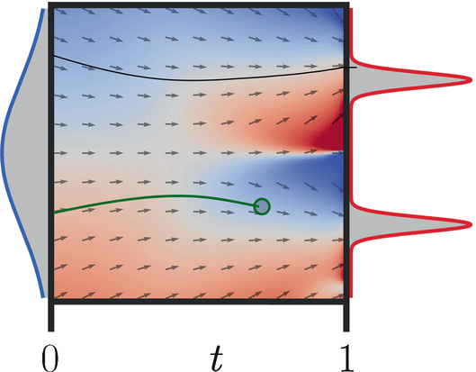

Flow matching loss encourages a learnable velocity field $v_t^{\theta}$ to match the ground truth velocity field $v_t$ known to generate the desired probability path $p_t$.
<div style="background-color: #F2F2F2; padding: 10px; border: 3px solid #535353; border-radius: 10px; text-align: center">

```math
\mathcal{L}_{\mathrm{FM}}(\theta) = \mathbb{E}_{t \sim \mathcal{U}[0,1]} \mathbb{E}_{x \sim p_t(x)} \| v_t^{\theta}(x) - v_t(x) \|^2
```

</div>

In order to learn the velocity field, one would like to get a supervision signal at each time step  $t$. However, there exists an infinite number of probability paths (and velocity fields) that transform $p$ into $q$. Thus, in order to get supervision for all $t$, one must fully specify a probability path (velocity field). But in the objective above both **$p_t$ and $v_t$ are unknown** making it intractable.

Another approach, proposed in [Lipman et al. (2023)](https://arxiv.org/pdf/2210.02747) avoids computing $p_t$ and $v_t$ explicitly and relies on probability paths and vector fields that are only defined *per sample*.


### Conditional Flow Matching: towards a tractable objective

A simple way to construct a target probability path is via a *mixture* of simpler probability paths. Specifically, let's assume that the **marginal probability path** $p_t(x)$ takes the form of a mixture involving **conditional probability paths** $p_t(x|z)$, where $z$ serves as a conditioning variable distributed according to $q(z)$:

```math
p_t(x) = \int p_t(x | z) q(z) \mathrm{d}z
```

The conditional probability path $p_t(x | z)$ is designed to satisfy $p_0(x|z) = p(x)$ at time $t = 0$ and be concentrated around $z$ at time $t = 1$: $p_1(x | z) \approx \delta_{z}(x)$. In other words, a conditional probability path gradually converts the source distribution $p$ into a *single* data point. 

As a result, the marginal probability $p_1(x)$ is a mixture distribution that closely approximates the data distribution $q$:

```math
p_1(x) = \int p_1(x|z) q(z) \mathrm{d}z  \approx q(x)
```


A natural design choice for the conditional probability path $p_t(x|z)$ is to adopt Gaussian distributions, expressed as $p_t(x | z) = \mathcal{N}(\mu_t(z), \sigma_t^2 \mathrm{I})$, with time-dependent means and variances. 


There are two popular choices to define the conditional probability paths.
<div style="background-color: #FFFDF5; padding: 10px">

1. Linear interpolation: $z=(x_0, x_1) \sim p_0 \times p_1$ and $p_t(x | z) = \mathcal{N}(x | (1 - t) \cdot x_0 + t \cdot x_1, \sigma^2 \mathrm{I}) \xrightarrow{\sigma \rightarrow 0} \delta_{(1 - t) \cdot x_0 + t \cdot x_1} (x)$.


2. Conical Gaussian paths: $z=x_1 \sim p_1$ and $p_t(x | z) = \mathcal{N}(x | t \cdot x_1, (1 - t)^2 \mathrm{I})$.


</div>


Now let's proceed with the assumption that the conditional probability paths $p_t(x|z)$ are generated by some **conditional vector field** $v_t(x|z)$. Then, one can also define a **marginal vector field**, by "marginalizing" over the conditional vector fields in the following sense 

```math
v_t(x) = \int v_t(x|z) p_t(z|x) \mathrm{d}z
```

where $v_t(\cdot|z) : \mathbb{R}^d \rightarrow \mathbb{R}^d$ is a conditional vector field that generates $p_t(\cdot|z)$ and $p_t(z|x) \propto p_t(x|z)q(z)$. It can be shown that this marginal vector field generates the marginal probability path $p_t(x)$ introduced above. This result allows us to construct the marginal vector fields from simple conditional vector fields, that are easy to compute.


For the conditional probability paths in the example above, one can show that:
<div style="background-color: #FFFDF5; padding: 10px">

1. Linear interpolation: $v_t(x|z=(x_0, x_1)) = x_1 - x_0$, constant.
    
2. Conical Gaussian paths: $v_t(x|z=x_1) = \frac{x - x_1}{1 - t}$.

</div>
So, the conditional probability fields were chosen to have simple associated conditional velocity fields.


This allow us to re-write the FM objective as follows:

```math
\mathcal{L}_{\mathrm{FM}}(\theta) = \mathbb{E}_{t \sim \mathcal{U}[0,1]} \mathbb{E}_{x \sim p_t(x|z), z \sim q(z)} \| v_t^{\theta}(x) - v_t(x) \|^2
```

Intuitively, this loss says: First, draw a random time $t \in [0, 1]$. Second, draw a random point $z$ from our data set, and then sample from $p_t(\cdot|z)$. Finally, compute the mean-squared error between the output of the neural network $v_t^{\theta}(x)$ and the marginal vector field $v_t(x)$. Unfortunately, despite knowing how to construct the training target from simple conditional vector fields, it still cannot be efficiently computed due to the intractable integral.

To address this, [Lipman et al. (2023)](https://arxiv.org/pdf/2210.02747) introduced the notion of *Conditional Flow Matching* (CFM) by showing that **regressing against the conditional vector field results in the same optima as the original objective**:
<div style="background-color: #F2F2F2; padding: 10px; border: 3px solid #535353; border-radius: 10px; text-align: center">

```math
\mathcal{L}_{\mathrm{CFM}}(\theta) = \mathbb{E}_{t \sim \mathcal{U}[0,1]} \mathbb{E}_{x \sim p_t(x|z), z \sim q(z)} \| v_t^{\theta}(x) - v_t(x|z) \|^2
```

</div>

As it turns out, by explicitly regressing against the tractable, conditional vector field, one is implicitly regressing against the intractable, marginal vector field.

Note: as opposed to the log-likelihood maximization loss of CNFs which does not put any preference over which vector field can be learned, the CFM loss does specify one via the **choice** of a conditional vector field.

---

## Flow models

### MeanFlow

In contrast to *instantaneous velocity* modeled by the standard Flow Matching, the study [Zhengyang et al. (2025a)](https://arxiv.org/pdf/2505.13447) introduces a **principled one-step generative framework trained from scratch** called *MeanFlow*.

It is based on the notion of *average (mean) velocity* to characterize flow fields.


Consider a trajectory governed by an ODE

```math
\frac{dz_t}{dt} = v(z_t,t)
```

For $r < t$, define

```math
u(z_t,r,t) = \frac{1}{t-r} \int_r^t v(z_s,s) \mathrm{d}s
```

This represents the average velocity from time $r$ to $t$.


Knowing the average velocity allows for a one-step generative process:

1. Sample noise: $\epsilon \sim \mathcal{N}(0,I)$
2. One forward pass: $x = \epsilon - u_\theta(\epsilon, r=0, t=1)$

Here, only one neural network evaluation is required.


The field of average velocity $u(z,r,t)$:

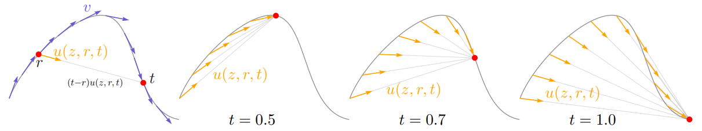

While the instantaneous velocity $v$ determines the tangent direction of the path, the average velocity $u(z, r, t)$ is **aligned with the displacement** between two time steps.

The main challenge is that we cannot directly compute the true average velocity to serve as a training target, because the trajectory depends on the unknown velocity field.

[Zhengyang et al. (2025a)](https://arxiv.org/pdf/2505.13447) derives an identity linking the instantaneous velocity $v$ and the average velocity $u$

<div style="background-color: #F2F2F2; padding: 10px; border: 3px solid #535353; border-radius: 10px; text-align: center">

```math
u(z_t,r,t) = v(z_t,t) - (t-r) \cdot \frac{d}{dt} u(z_t,r,t)
```

</div>

This equation is called the *MeanFlow Identity*. It is derived from differentiating the definition of the average velocity.


During training, the average velocity parametrized by a neural network $u_\theta(z_t,r,t)$ that is encouraged to satisfy the MeanFlow Identity:

```math
\mathcal{L}  = \mathbb{E}  \| u_\theta(z_t,r,t) - u_{\text{target}} \|^2
```

where $u_{\text{target}} = \mathrm{stopgrad} \left[ (t-r) \cdot \frac{d}{dt} u(z_t,r,t) \right]$ 

Unlike other heuristic approaches, this objective trains the network to produce a **mean velocity field consistent with the true flow**.


Finally, MeanFlow incorporates classifier-free guidance (CFG) into the target field, incurring no additional cost at sampling time when guidance is used. This formulation allows to enjoy the benefits of CFG while maintaining the 1-NFE generation during sampling.

---

### ImprovedMeanFlow

The *MeanFlow (MF)* framework introduced a principled way to achieve one-step generation by learning the *average velocity field* of probability flows.

However, the original MeanFlow formulation suffers from two major problems:

1. **Unstable training objective**. The original MeanFlow training objective relies on a **target that depends on the model itself**. In other words, the model is trained to match a "moving target". This creates high-variance gradients leading to unstable optimization.

2. **Inflexible classifier-free guidance (CFG)**. In the original MeanFlow implementation the CFG scale is fixed during training. iMF reformulates the model as being conditioned on the guidance scale allowing for sampling different scale values during training.


[Zhengyang et al. (2025b)](https://arxiv.org/pdf/2512.02012v1) introduces *Improved MeanFlow (iMF)* to solve these issues while preserving the 1-step generation ability. 

The main idea is reformulating the loss to **predict the instantaneous velocity instead of the average velocity**.

Starting from the MeanFlow identity

```math
u(z_t,r,t) = v(z_t,t) - (t-r)\cdot \frac{d}{dt}u(z_t,r,t)
```

we can rearrange it:

```math
v(z_t,t) = u(z_t,r,t) + (t-r) \frac{d}{dt} u(z_t,r,t) 
```

And the training target becomes the instantaneous velocity, which is **independent of the neural network**. 

However, now the right hand side depends on the instantaneous velocity (inside the time derivative). The paper proposes two ways to implement $v_\theta$.

1. Boundary condition reuse: using the property $v_\theta(z_t,t) = u_\theta(z_t,t,t)$, This requires no extra parameters.

2. Auxiliary velocity head: Add a small additional prediction head for $v_\theta(z_t,t)$. This slightly increases modeling flexibility.

Now the learning problem becomes a **standard regression task**, similar to Flow Matching. This formulation removes the **self-referential training target** and stabilizes optimization.

---

### SplitMeanFlow

The key limitation of the **MeanFlow** is that it requires computing derivatives via Jacobian-vector products (JVPs), which complicates training and implementation. 

The core idea behind the MeanFlow is the so-called *MeanFlow Identity* connecting average velocity and instantaneous velocity.

This identity contains derivatives which must be computed via computationally demanding JVPs during training.

To address this problem, [Guo et al. (2025)](https://arxiv.org/pdf/2507.16884) proposes a new framework called *SplitMeanFlow*.

The key insight comes from a simple property of definite integrals which yields a purely algebraic relationship called the *Interval Splitting Consistency* identity:

<div style="background-color: #F2F2F2; padding: 10px; border: 3px solid #535353; border-radius: 10px; text-align: center">

```math 
(t-r) \cdot u(z_t,r,t) = (s-r) \cdot u(z_s,r,s) + (t-s) \cdot u(z_t,s,t) 
```

</div>

Conceptual illustration of the idea behind SplitMeanFlow:

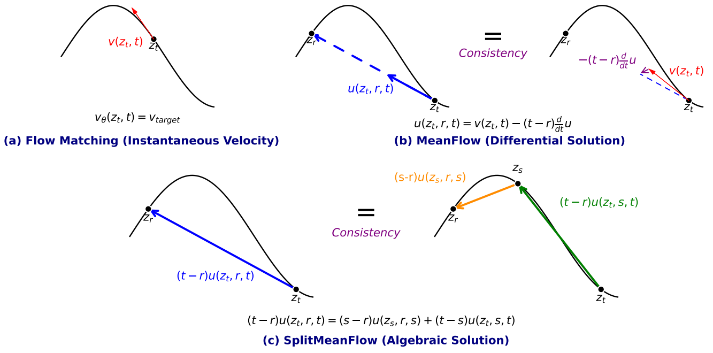 

    
Unlike MeanFlow, SplitMeanFlow does **not require derivatives of the network output**.

SplitMeanFlow naturally supports few-step generation. Instead of a single jump $[0,1]$ the model can sequentially apply splits: $1 \rightarrow t_1 \rightarrow t_2 \rightarrow 0$. Because the training objective enforces **consistency across intervals**, the model remains valid for arbitrary step partitions.

---

### $\alpha$-Flow

[Zhang et al. (2025)](https://arxiv.org/pdf/2510.20771) shows that the MeanFlow objective naturally decomposes into two parts: trajectory flow matching and trajectory consistency. These two terms are strongly negatively correlated, causing optimization conflict and slow convergence. This insights motivate introduction of the **$\alpha$-Flow**, a broad family of objectives that unifies trajectory flow matching and MeanFlow under one formulation. By adopting a curriculum strategy that smoothly anneals from trajectory flow matching to MeanFlow, $\alpha$-Flow disentangles the conflicting objectives leading to better convergence. 

---

### Variational Flow Matching

*Variational Flow Matching* (VFM) introduced in [Eijkelboom et al. (2024)](https://arxiv.org/pdf/2406.04843) reformulates Flow Matching as a *variational inference* problem. Instead of directly learning the marginal velocity field, the model learns a **variational approximation of the posterior distribution over trajectory endpoints**. 

VFM reinterprets Flow Matching through variational inference. Unlike the standard Flow Matching, which directly regresses the velocity field, VFM models it by approximating the unknown posterior distribution defining the *marginal velocity field*:

<div style="background-color: #F2F2F2; padding: 10px; border: 3px solid #535353; border-radius: 10px; text-align: center">

```math
v_t(x) = \int v_t(x|x_1) p_t(x_1|x) \mathrm{d}x_1 \approx \int v_t(x|x_1) q_t(x_1|x) \mathrm{d}x_1 
```

</div>

To ensure that $q_t(z|x)$ accurately approximates the posterior $p_t(z|x)$, VFM minimizes the following KL-divergence between their joint distributions

```math
\mathcal{L}_{\mathrm{VFM}} = \mathrm{KL} \big(p_t(x_1, x) | q_t(x_1, x) \big) = - \mathbb{E}_{x_1, x, t} \left[ \log q_t(x_1|x) \right] + C
```

While such re-formulation does not seem useful due to the intractability of $v_t(x)$, it was shown that calculation of the marginal vector field can be simplified under the typical case where the **conditional vector field $v_t(x | x_1)$ is linear in $x_1$**. Specifically, without loss of generality, a fully-factorized (aka *mean-field*) approximation is used as $q_t(z|x)$, making the VFM objective no more computationally demanding than standard Flow Matching.

In summary, the differences between VFM and standard Flow Matching:
* FM learns a vector field
* VFM learns a posterior over trajectory endpoints $x_1$

---

## Examples

**Note**: the results may not match paper quality because they were obtained with limited GPU resources.

### MNIST

| Model | steps=1 | steps=32 |
| --- | --- | --- |
| [Vanilla FM](https://arxiv.org/pdf/2210.02747) | 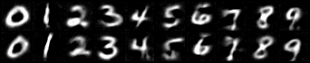 | 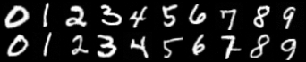 |
| [Variational FM](https://arxiv.org/pdf/2406.04843) | 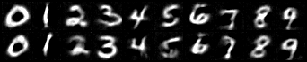 | 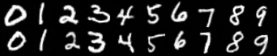 |
| [MeanFlow (MF)](https://arxiv.org/pdf/2505.13447) | 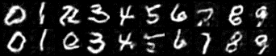 | 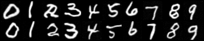 |
| [Improved MF](https://arxiv.org/pdf/2512.02012v1) | 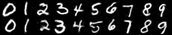 | 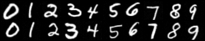 |
| [Split MF](https://arxiv.org/pdf/2507.16884) | 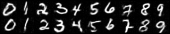 | 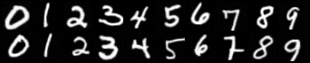 |
| [AlphaFlow](https://arxiv.org/pdf/2510.20771) | 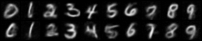 | 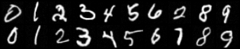 |

The Improved MeanFlow model seems to produce the best images with one-step inference. For some reason, the results for AlphaFlow do not look so good, as expected. 

### CIFAR10

| Model | steps=2 | steps=32 |
| --- | --- | --- |
| [Vanilla FM](https://arxiv.org/pdf/2210.02747) | 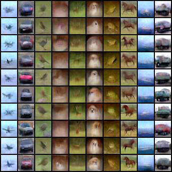 | 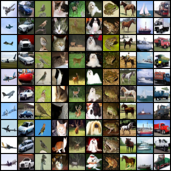 |
| [Split MF](https://arxiv.org/pdf/2507.16884) | 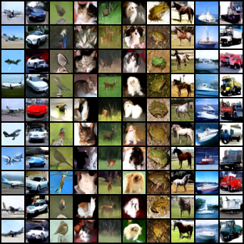 | 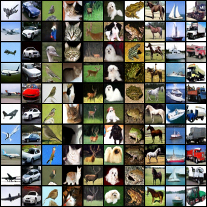 |

One can see that the SplitMeanFlow model was able to produce recognizable images with only two steps. Here, the CFG scale was set to 4.0.

### CelebA

Centered and cropped to a size of 64x64.

| Model | steps=4 | steps=32 |
| --- | --- | --- |
| [Vanilla FM](https://arxiv.org/pdf/2210.02747) | 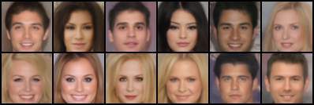 | 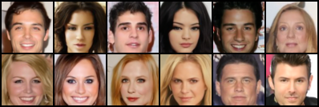 |
| [Split MF](https://arxiv.org/pdf/2507.16884) | 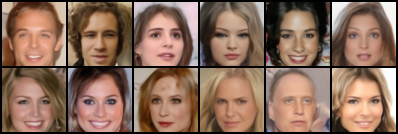 | 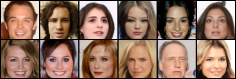 |

Again, SplitMeanFlow required less steps to produce images with sufficient amount of detail.

---

## Notes

### Attention and JVP

PyTorch's built-in **scaled dot-product attention** (`torch.nn.functional.scaled_dot_product_attention`) does **not** support JVP, while MeanFlow-like models require JVPs to compute the time derivative $\frac{d}{dt}u(z_t,r,t)$ in the training objective. When training such models with a backbone that includes attention, use a JVP-capable attention backend; see `src/layers/attn.py` for options.

Also, `jvp` significantly increases GPU memory usage.

### TODO
- [x] Implement basic training and sampling
- [ ] Enable multi-GPU training
- [ ] Check [rcm](https://github.com/NVlabs/rcm) that implements FlashAttention JVP kernel
- [ ] Try [gradient modulation](https://github.com/primepake/modular_meanflow)
- [ ] Implement [FlowConsist](https://arxiv.org/pdf/2602.06346)

---

## Acknowledgments

This repository is built on numerous open-source codebases such as [Diffusion](https://github.com/FutureXiang/Diffusion), [TorchCFM](http://github.com/atong01/conditional-flow-matching), [guided-diffusion](https://github.com/openai/guided-diffusion).
